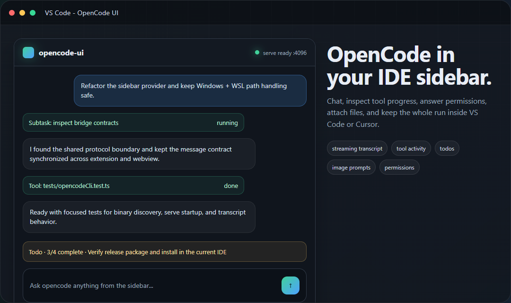
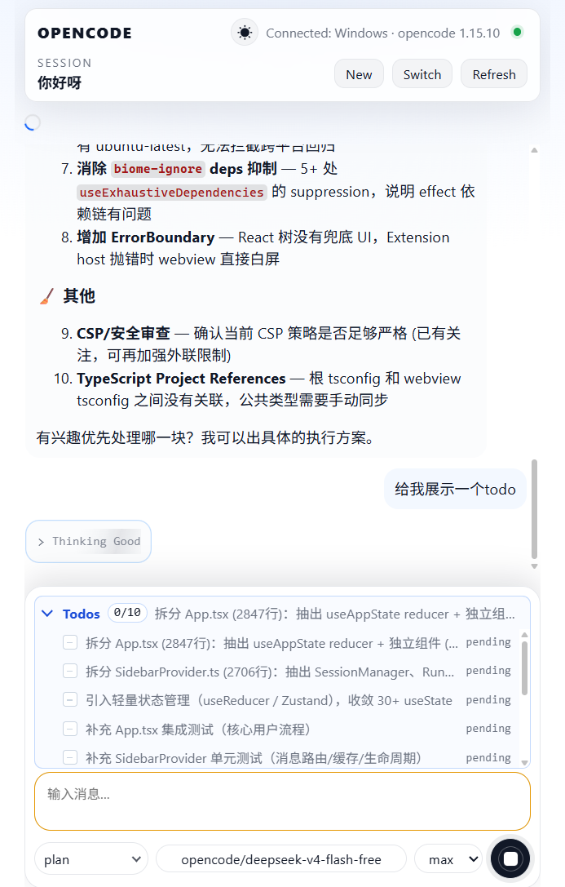
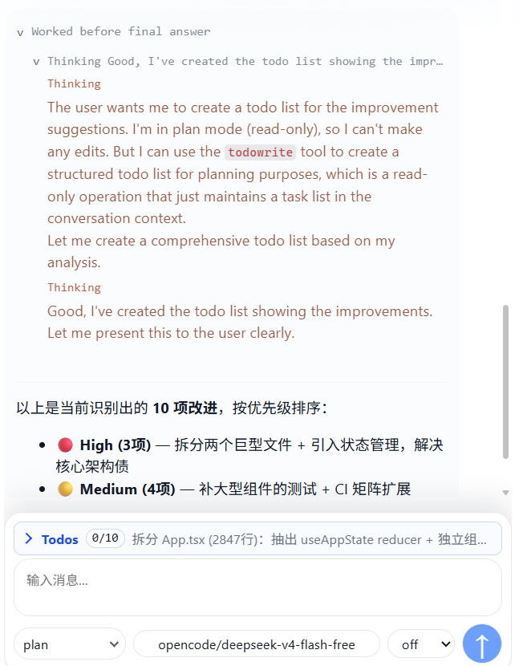

# opencode-ui

语言：[English](./README.md) | 简体中文

`opencode-ui` 是一个适用于 VS Code 兼容 IDE 的扩展，用来把 OpenCode 聊天界面带到 IDE 侧边栏中。它会连接当前扩展宿主环境里的 `opencode` CLI，按需启动 `opencode serve`，并在 React/Vite Webview 中展示会话、流式回答、工具调用、权限确认、模型、agent、todo 和图片附件。

该扩展面向 VS Code，也适用于 Cursor 等兼容 IDE。

## 预览



| Todo 规划面板 | Thinking 详情 |
| --- | --- |
|  |  |

## 功能

- 在 IDE Activity Bar 中提供 OpenCode 侧边栏聊天界面。
- 自动启动 `127.0.0.1` 上的 `opencode serve`，优先使用 `4096` 端口，冲突时自动回退到空闲端口。
- 自动在 Windows、Linux、WSL、Remote-SSH 等常见环境中发现 `opencode` 可执行文件。
- 支持会话列表、切换、导出、删除、时间线、撤销和重做。
- 支持 provider、model、agent 选择和刷新。
- 支持文本、reasoning、工具、子任务、todo、权限请求和问题请求的流式 transcript 展示。
- 支持图片/文件 prompt，并根据当前宿主环境归一化路径。
- 提供诊断浮层和 `/debug`，可自检 sessions、models、agents 与请求日志。

## 环境要求

- VS Code 兼容宿主，扩展 API `>=1.105.0`。
- 开发环境需要 Node.js `>=20.0.0` 和 npm `>=10.0.0`。
- `opencode >=1.15.10`，并且必须安装在扩展实际运行的宿主环境中。

检查 CLI 版本：

```powershell
opencode --version
```

## 支持的宿主环境

| 宿主 | 状态 | 说明 |
| --- | --- | --- |
| Windows 本机 | 支持 | 可发现 npm、Volta、Scoop、Chocolatey、pnpm、Yarn、Bun、Mise、PATH 和常见用户目录中的 `.exe`、`.cmd`、`.bat`。 |
| Linux 本机 | 支持 | 可发现 `~/.opencode/bin`、`~/.local/bin`、Bun、pnpm、Volta、Mise 等常见用户级安装目录。 |
| Remote-WSL | 支持 | `opencode` 需要安装在 WSL 发行版内部，因为扩展宿主运行在那里。 |
| Remote-SSH Linux | 支持 | `opencode` 需要安装在远端 Linux 机器上。 |
| 通用 Linux 远端 | 支持 | 按 Linux 远端宿主处理。 |
| macOS 或非 Linux 远端 | 暂不支持 | 扩展会提示不支持，并跳过 `opencode serve` 启动。 |

如果安装位置比较特殊，可以手动指定：

```powershell
$env:OPENCODE_BINARY = "C:\path\to\opencode.exe"
```

Linux/WSL：

```bash
export OPENCODE_BINARY=/path/to/opencode
```

## 从源码安装

安装依赖：

```bash
npm ci
npm --prefix webview-ui ci
```

构建和验证：

```bash
npm run check
```

打包 VSIX：

```bash
npm run package
```

安装到 VS Code：

```bash
code --install-extension vsix/opencode-ui-vscode-0.0.78.vsix --force
```

安装到 Cursor：

```bash
cursor --install-extension vsix/opencode-ui-vscode-0.0.78.vsix --force
```

如果版本号更新，请按当前 `package.json` 版本调整 VSIX 文件名。

## 开发

常用命令：

```bash
npm run build
npm --prefix webview-ui run build
npm run watch
npm --prefix webview-ui run dev
npm test
npm run test:extension
```

提交 PR 或构建发布前的主要检查：

```bash
npm run check
```

如果改动涉及扩展激活或打包后的 IDE 行为，再运行：

```bash
npm run test:extension
```

## 仓库结构

- `src/extension.ts` - 扩展激活、宿主识别、命令和侧边栏注册。
- `src/bridge/` - `opencode` CLI 封装、serve 管理、兼容性检查和输出解析器。
- `src/shared/protocol.ts` - Webview 与扩展之间的类型化消息协议。
- `src/webview/SidebarProvider.ts` - VS Code、`opencode serve`、CLI helper 与 Webview 之间的桥接层。
- `webview-ui/` - React/Vite Webview 应用。
- `tests/` - Vitest 测试，覆盖解析器、宿主识别、serve 启动、运行流、UI 状态 helper 和回归场景。
- `out/` 与 `media/` - VSIX 中包含的已生成运行产物。
- `vsix/` - 本地打包输出目录，默认被 git 忽略；仓库 Release 中提供可下载的 VSIX。

不要手工编辑 `out/` 或 `media/` 中的生成文件；请修改源码后执行 `npm run build`。

## CI

GitHub Actions 会在 push 和 pull request 时运行检查并打包 VSIX artifact：

```bash
npm run check
npm run package
```

维护者可以在仓库 Secrets 中添加 `AZURE_CLIENT_ID` 和 `AZURE_TENANT_ID`，然后手动运行 `Publish Marketplace` workflow。该流程会先通过 GitHub Actions OIDC 登录 Azure，并在运行日志和摘要里打印托管身份的 Marketplace User Id；把这个 User Id 加入 Visual Studio Marketplace publisher，角色设为 Contributor。流程随后会重新构建并验证项目，根据 `github-upload/release.json` 生成公开 VSIX，上传 artifact，并使用 `vsce --azure-credential` 发布到插件市场。

## 反馈与 Issue

欢迎大家提出 bug、宿主环境适配问题、UI 建议和新功能需求。可以通过 [GitHub Issues](https://github.com/tiyuhujiao/opencodeUI/issues) 反馈；如果是问题报告，建议附上宿主环境、IDE、`opencode --version` 和已脱敏的诊断信息，方便复现。

## 常见问题

如果侧边栏提示找不到 `opencode`：

- 在扩展实际运行的同一个宿主环境中执行 `opencode --version`。
- Remote-WSL 或 Remote-SSH 中，需要在远端环境安装 `opencode`，不能只装在 Windows 本机。
- 如果安装目录不常见，设置 `OPENCODE_BINARY` 为绝对路径。
- 打开侧边栏诊断浮层并运行 self-check。

如果 `4096` 端口被占用，扩展会自动在其他空闲端口启动 `opencode serve`，并按宿主类型缓存该端口。

## 发布说明

发布说明可以通过 GitHub Releases 或 VSIX artifact 描述发布。

## 许可证

MIT。详见 [`LICENSE`](./LICENSE)。
