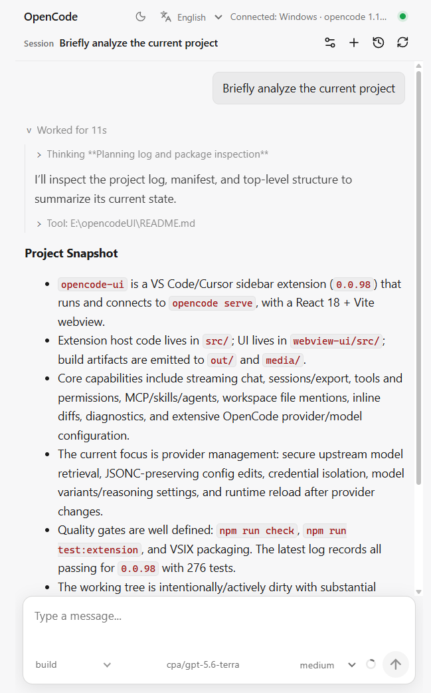
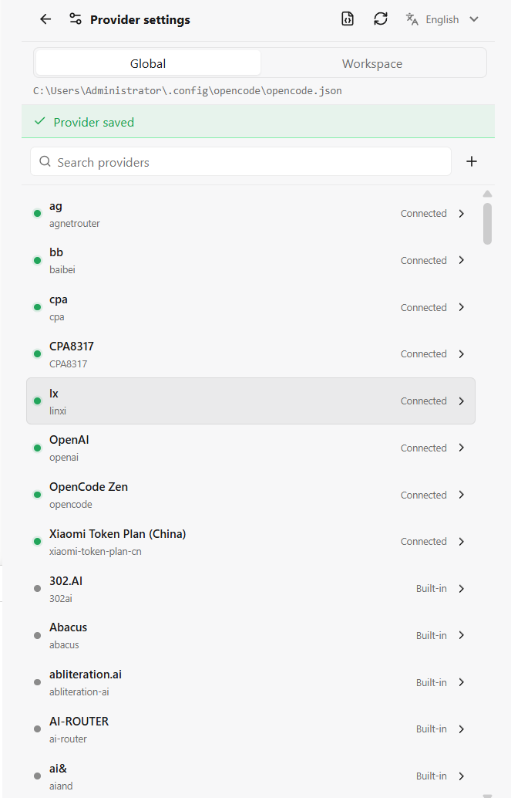
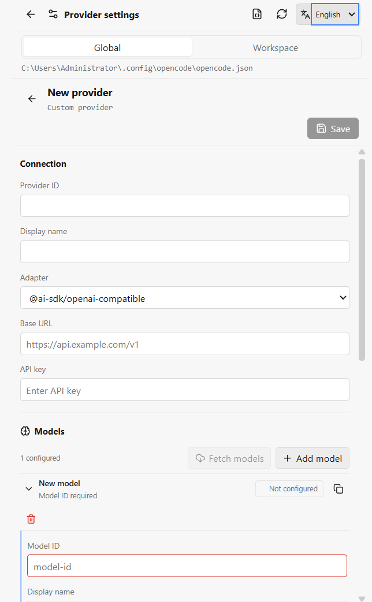
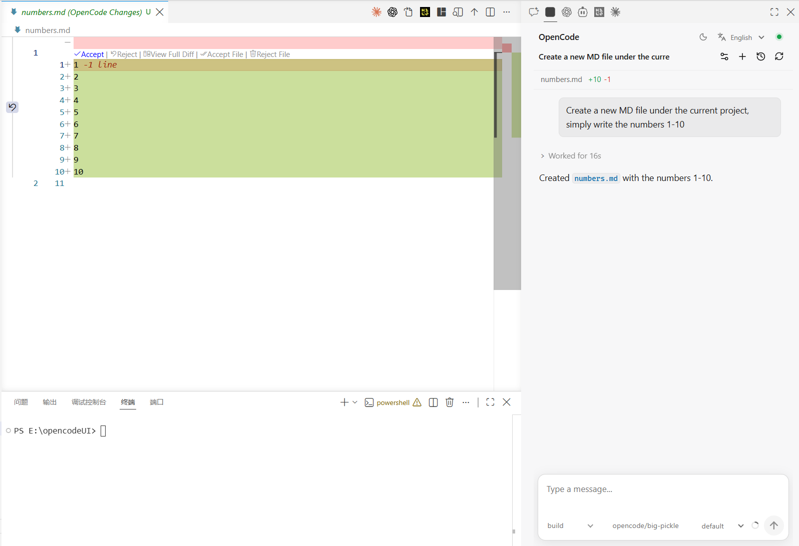

# opencode-ui

[English](./README.md) | 简体中文

[](https://marketplace.visualstudio.com/items?itemName=tiyuhujiao.opencode-ui-vscode)
[](https://github.com/tiyuhujiao/opencodeUI/releases/latest)
[](./LICENSE)

OpenCode 很强大，但使用它不应该意味着反复切换编辑器、终端和配置文件。我们设计 `opencode-ui`，是希望在 VS Code 中提供一个清晰、顺手的可视化界面，让对话、工具、模型选择与代码改动都留在工作发生的地方。

`1.0.1` 在彻底设计与重构后的扩展基础上，正式加入对 Apple Silicon 与 Intel Mac 的完整支持。扩展可以自动发现通过官方安装脚本、Homebrew、MacPorts 和常见 JavaScript 包管理器安装的 OpenCode，并在所有受支持的宿主环境中保持一致的可视化工作流。

## 界面预览



## 支持平台

| 宿主环境 | 支持方式 |
| --- | --- |
| Windows | 本机 |
| Linux | 本机、Remote-SSH 与其他 Linux 远端宿主 |
| macOS | Apple Silicon 或 Intel 本机、Remote-SSH 与其他 macOS 远端宿主 |
| WSL | Remote-WSL |

扩展可运行于 VS Code、Cursor 及其他兼容 VS Code 的宿主。请将 OpenCode CLI 安装在扩展实际运行的同一本机或远端环境中。

## 1.0.1 新增内容

### macOS 支持

现在可以在 macOS 上直接使用完整的侧边栏工作流，不需要额外配置扩展。无论通过官方安装脚本、Homebrew、npm、Bun、pnpm、Yarn、Mise 或 MacPorts 安装 OpenCode，`opencode-ui` 都会查找常见的 CLI 位置；即使从 Finder 打开 VS Code、环境中的 `PATH` 较短，也能正确找到 OpenCode。

## 核心功能

### 快捷自定义供应商

你可以直接在 VS Code 中连接内置供应商，或者快速创建自己的供应商。可视化编辑器支持多个模型、思考强度、上下文与最大输出、价格、headers、凭据和上游模型拉取；需要更细致控制时，也保留了完整的高级配置。

| 浏览和管理供应商 | 快速创建自定义供应商 |
| --- | --- |
|  |  |

### VS Code Inline Diff

OpenCode 修改代码后，可以直接在编辑器里查看 inline diff。新增和删除内容一目了然，并且可以按区块、按文件或整体接受与拒绝，不必离开当前工作区。



### 中英文双语

界面可以随时在 English 和简体中文之间切换。设置、提示、弹窗与状态反馈都会跟随语言选择，同时 `Thinking`、`Tools` 等熟悉的技术术语保持清晰一致。

## 还可以做什么

- 在 VS Code 侧边栏与 OpenCode 对话，查看流式回答、`Thinking`、工具调用、子任务、todo、权限与问题请求。
- 不必逐项手写配置，即可创建和管理供应商与模型。
- 在接受代码改动前，通过 inline diff 完成审阅。
- 管理会话、历史、导出、撤销与重做，并使用文件、图片、MCP、skills 和 agents。
- 支持 macOS、Windows、Linux、Remote-WSL，以及 Remote-SSH Linux/macOS，也可用于 Cursor 等兼容 VS Code 的 IDE。

## 使用前提

请先在 VS Code 扩展实际运行的本机或远端环境中安装 [OpenCode CLI](https://opencode.ai/)：

```bash
opencode --version
```

这是唯一必需的运行依赖。`opencode-ui` 会自动查找 CLI，并在需要时启动 `opencode serve`。

## 安装

**从 VS Code 插件市场安装**

打开 VS Code 的扩展页面，搜索 **opencode-ui**，安装发布者为 **tiyuhujiao** 的扩展。也可以直接打开 [VS Code Marketplace 页面](https://marketplace.visualstudio.com/items?itemName=tiyuhujiao.opencode-ui-vscode)。

**从 GitHub Releases 安装**

前往 [GitHub Releases](https://github.com/tiyuhujiao/opencodeUI/releases/latest) 下载最新的 `.vsix`，然后在 VS Code 中运行 **Extensions: Install from VSIX...** 即可。

## 反馈

欢迎大家提出想法、问题和界面建议，可以直接提交 [GitHub Issue](https://github.com/tiyuhujiao/opencodeUI/issues)，我们会继续把这个项目做得更顺手。若 `opencode-ui` 让你的 OpenCode 使用体验轻松了一点，也欢迎点亮一个 Star。

## 许可证

MIT，详见 [LICENSE](./LICENSE)。
